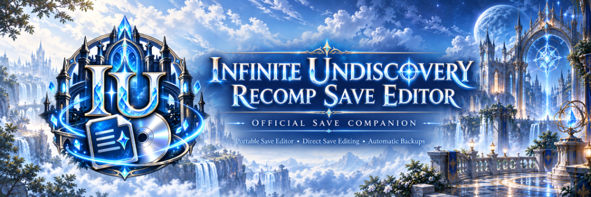

<p align="center">
  
</p>

# Infinite Undiscovery Recomp Save Editor (IU Save Bridge v2.2.0) - Guía en Español

**IU Save Bridge v2.2.0** es el editor de partidas guardadas oficial diseñado específicamente para [**Infinite Undiscovery Recomp**](https://github.com/doc-haz/infinite-undiscovery-recomp).

Proporciona una interfaz visual moderna de fantasía cristalina con alto contraste, edición directa sin conceptos complejos de staging, copias de seguridad automáticas obligatorias con marca de tiempo y verificación íntegra del algoritmo dual CRC32 de Tri-Ace.

---

## Aspectos Destacados

- **Flujo Directo y Transparente:** `Abrir Partida -> Editar -> Guardar Cambios`. Se eliminan las carpetas intermedias de staging y contenedores CON/STFS de la experiencia del usuario, conservando internamente el reemplazo atómico seguro.
- **Backups Obligatorios Automáticos:** Antes de modificar cualquier archivo de guardado real, se crea una copia de seguridad en `backups\<REGION>\` con sellado de tiempo no colisionante. Si el backup falla, la partida jamás se modifica.
- **Integración Nativa con Infinite Undiscovery Recomp:** Detección de instalaciones portables (`<recompRoot>\<REGION>\saves\`) con compatibilidad para regiones **NTSC-U** y **PAL**.
- **Aislamiento Estricto de DLC y Runtime:** Ignora automáticamente carpetas de DLC y contenido runtime (como `0000000000000000\535107DB\00000002` y `cache\`), procesando únicamente slots reales verificados (`00000001\InfiniteUndiscovery_*.bin`).
- **Diseño Estético Recomp:** Encabezado azul zafiro con detalles dorados, paneles esmerilados translúcidos, tipografía de alto contraste e ilustración integrada (`IU_Recomp_Save_Editor_Menu.png`).
- **100% Portable:** Cero escrituras en el Registro de Windows, `%APPDATA%` o directorios de usuario. Los ajustes se guardan en `config.json` junto al ejecutable.
- **Ejecutable Autónomo:** Icono multirresolución (`.ico`), catálogo de 1,023 ítems (`ItemNames.txt`) e ilustraciones embebidas directamente en el binario sin dependencias externas.
- **Conmutación Bilingüe Instantánea:** Cambio en vivo entre Español (`es`) e Inglés (`en`) con 100% de paridad en cadenas y nombres canónicos oficiales.

---

## Características por Pestaña

### 1. Partidas (`Saves`)
- Detección automática de partidas guardadas en la región activa del recomp.
- Información detallada por slot: número de slot, nombre de carpeta, fecha de modificación, tamaño, Fol actual, hash SHA-256 y estado del CRC dual.
- Vista previa del thumbnail real capturado en el juego (`__thumbnail.png`).
- Edición directa de Fol (hasta 99,999,999) con recálculo en tiempo real del doble CRC32 de Tri-Ace.
- Botón **Guardar Cambios** con respaldo de seguridad automático, reemplazo atómico temporal y refresco inmediato.

### 2. Personajes (`Characters`)
- Soporte completo para los 18 personajes jugables:
  *Capell, Aya, Eugene, Michelle, Kiriya, Sigmund, Edward, Komachi, Rico, Rucha, Kristofer, Balbagan, Touma, Savio, Vic, Gustav, Dominica, Seraphina*.
- Atributos editables por personaje:
  - Nivel (1 – 255) y EXP (0 – 99,999,999)
  - HP Actual y HP Máximo (1 – 99,999)
  - MP Actual y MP Máximo (1 – 99,999, guardado a escala x1000 en el binario)
  - Atributos Base: ATK, DEF, HIT, AGL, INT (0 – 9,999)
  - Puntos de Acción / AP (0 – 99,999)
  - Indicadores de grupo: *En el Grupo* y *Grupo Activo*
- Preajuste rápido: botón **Maximizar Stats** (establece HP/MP a 9999, stats a 999, AP a 10,000).

### 3. Inventario (`Inventory`)
- Catálogo completo de **1,023 objetos** (armas, armaduras, accesorios, consumibles, materiales y grimorios) embebido en el ejecutable.
- Buscador en tiempo real por nombre o ID de objeto.
- Casilla para filtrar únicamente objetos poseídos.
- Ajuste individual de cantidad (0 – 99) con contador total de ítems en posesión.
- Acción masiva: botón **Todos x99** para colocar el inventario completo en cantidad máxima.

### 4. Backups (`Backups`)
- Gestión organizada por región (`backups\NTSC-U\` y `backups\PAL\`).
- Nombres con marca temporal no colisionante: `InfiniteUndiscovery_<slot>_<yyyyMMdd_HHmmss>[_seq].bin`.
- Archivos `.meta` con Fol, fecha, slot y hash SHA-256.
- Preservación de la miniatura de la partida junto a la copia de seguridad.
- Botón **Restaurar Backup** con creación automática previa de un backup de seguridad de la partida activa antes de sobrescribirla.

### 5. Ajustes (`Settings`)
- Autodetección de la ruta del Recomp o selección manual mediante explorador.
- Conmutador de región: alternar entre partidas de **NTSC-U** y **PAL**.
- Selector de idioma en tiempo real: alternar entre **Español** e **English**.
- Accesos directos a directorios y estado de portabilidad.

---

## Estructura de Directorios

Despliegue típico junto a Infinite Undiscovery Recomp:

```
InfiniteUndiscoveryRecomp\
├── InfiniteUndiscoveryRecomp.exe
├── setup.json
├── NTSC-U\
│   └── saves\
│       ├── 0000000000000000\      <- Ignorado estrictamente (DLC y compartido)
│       └── 1234567890ABCDEF\
│           └── 535107DB\
│               └── 00000001\      <- Partidas detectadas aquí
│                   ├── InfiniteUndiscovery_0001.bin\
│                   │   ├── InfiniteUndiscovery.dat
│                   │   └── __thumbnail.png
│                   └── InfiniteUndiscovery_0002.bin\
├── PAL\
│   └── saves\
└── IU Save Bridge\
    ├── IU_Save_Bridge.exe         <- Ejecutable autónomo
    ├── config.json                <- Ajustes portables
    └── backups\
        ├── NTSC-U\
        └── PAL\
```

---

## Especificaciones Técnicas

- **Tamaño del archivo:** Exactamente 409,600 bytes (`0x64000`).
- **Firma / Magic:** `0x55445356` (`UDSV` en ASCII Big-Endian).
- **Versión de formato:** `0x00000033`.
- **Title ID:** `0x535107DB`.
- **Algoritmo Dual CRC32 (Polinomio IEEE Tri-Ace `0x04C11DB7`):**
  - **CRC1 (offset `0x14`):** Checksum sobre la cabecera (offsets `0x00` a `0xE7`, 232 bytes) con campos CRC en cero durante el cálculo.
  - **CRC2 (offset `0x18`):** Checksum sobre los datos del juego (offsets `0xE8` a `0x63FFF`, 409,368 bytes).
- **Plataforma objetivo:** Windows x64 (.NET Framework 4.8 / Windows Forms).

---

## Comandos por Consola (CLI)

`IU_Save_Bridge.exe` incluye comandos para automatización y scripts:

```bash
# Verificar integridad, firma, versión, Fol, SHA-256 y checksums duales
IU_Save_Bridge.exe verify <ruta_archivo.dat>

# Modificar Fol desde la terminal con recálculo automático de CRC
IU_Save_Bridge.exe set-fol <origen.dat> <destino.dat> <cantidad>

# Mostrar ayuda y sintaxis disponible
IU_Save_Bridge.exe --help
```

---

## Licencia y Créditos

- Diseñado para [Infinite Undiscovery Recomp](https://github.com/doc-haz/infinite-undiscovery-recomp).
- Infinite Undiscovery © Square Enix / tri-Ace.
